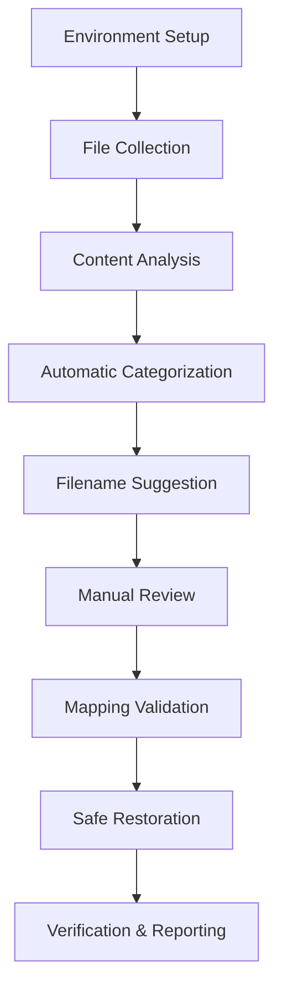

# Design Document

## Overview

The misc file recovery system implements a multi-phase approach to safely analyze, categorize, and restore miscellaneous files generated during VSCode recovery. The system uses intelligent content analysis combined with manual review to ensure accurate file restoration while maintaining complete data safety through comprehensive backup strategies.

## Architecture

### Phase-Based Processing Pipeline



### Directory Structure

```
recovery-workspace/
├── analysis/           # Copied misc files for analysis
├── sorted/            # Files categorized by type
│   ├── components/
│   ├── pages/
│   ├── utils/
│   ├── hooks/
│   ├── api/
│   ├── styles/
│   ├── config/
│   ├── types/
│   └── unknown/
├── manual-review/     # Files requiring manual inspection
├── final/            # Final mapped files ready for restoration
├── backups/          # Timestamped backups
└── reports/          # Analysis and execution reports
```

## Components and Interfaces

### 1. Environment Manager

**Purpose:** Creates and manages the safe working environment

**Key Functions:**
- `createWorkspace()`: Establishes directory structure
- `createBackup()`: Creates timestamped backups
- `validateEnvironment()`: Ensures all required directories exist

**Safety Features:**
- Never modifies original files
- Creates multiple backup layers
- Validates disk space before operations

### 2. File Collector

**Purpose:** Gathers misc files from multiple backup locations

**Key Functions:**
- `collectFromPath(path)`: Copies files from specified backup directory
- `validateFileIntegrity()`: Ensures copied files match originals
- `generateInventory()`: Creates manifest of collected files

**Source Locations:**
- `/Users/duting/Downloads/money💰/recovered-from-vscode/`
- `/Users/duting/Downloads/money💰/restored-project/`

### 3. Content Analyzer

**Purpose:** Analyzes file content to determine type and purpose

**Analysis Rules:**
```javascript
const analysisRules = {
    components: [
        /export\s+default\s+function\s+\w+Component/,
        /export\s+default\s+\w+Component/,
        /import.*from\s+['"]react['"]/,
        /jsx|tsx/i,
        /return\s*\(/,
        /useState|useEffect|useContext/
    ],
    pages: [
        /export\s+default\s+function\s+\w+Page/,
        /getServerSideProps|getStaticProps/,
        /next\/head|next\/router/,
        /pages?\//i
    ],
    api: [
        /export\s+default\s+function\s+handler/,
        /req\.method|res\.status/,
        /NextApiRequest|NextApiResponse/,
        /api\//i
    ],
    // ... additional rules for utils, hooks, styles, config, types
};
```

**Confidence Scoring:**
- Each rule match increases confidence score
- Final confidence = matches / total_rules_for_category
- Primary category = highest confidence score

### 4. Filename Guesser

**Purpose:** Suggests original filenames based on content analysis

**Guessing Strategies:**
1. **Function/Component Names:** Extract from export statements
2. **File Path Hints:** Look for path references in comments
3. **Import Patterns:** Analyze what the file imports/exports
4. **Content Signatures:** Match against known patterns

**Fallback Naming:**
- Use category + simplified misc number
- Preserve file extension based on content type
- Add descriptive suffixes when multiple files have similar content

### 5. Manual Review Interface

**Purpose:** Provides structured review process for human validation

**Review Categories:**
- **High Confidence (>80%):** Auto-suggest with review option
- **Medium Confidence (40-80%):** Require manual confirmation
- **Low Confidence (<40%):** Flag for detailed manual review
- **Conflicts:** Files that might overwrite existing content

### 6. Mapping Validator

**Purpose:** Validates proposed file mappings before execution

**Validation Checks:**
- Target path doesn't conflict with existing files
- Filename follows project conventions
- Directory structure is valid
- No circular dependencies created

### 7. Safe Restorer

**Purpose:** Executes the actual file restoration with safety guarantees

**Restoration Process:**
1. Create target directory structure
2. Copy files to temporary staging area
3. Validate all copies successful
4. Move from staging to final locations
5. Generate restoration log

## Data Models

### FileAnalysis
```typescript
interface FileAnalysis {
    filePath: string;
    fileName: string;
    size: number;
    lines: number;
    content: string;           // First 500 characters
    categories: string[];      // All matching categories
    confidence: Record<string, number>;  // Confidence per category
    primaryCategory: string;   // Best match category
    suggestedName?: string;    // Proposed filename
    suggestedPath?: string;    // Proposed target path
}
```

### FileMapping
```typescript
interface FileMapping {
    sourceFile: string;        // Original misc-*.js filename
    targetPath: string;        // Proposed target location
    confidence: number;        // Overall confidence in mapping
    reviewStatus: 'pending' | 'approved' | 'rejected' | 'modified';
    conflicts?: string[];      // Any detected conflicts
    manualNotes?: string;      // User annotations
}
```

### RecoveryReport
```typescript
interface RecoveryReport {
    totalFiles: number;
    categorization: Record<string, number>;
    highConfidence: number;
    mediumConfidence: number;
    lowConfidence: number;
    restored: number;
    skipped: number;
    errors: string[];
    executionTime: number;
}
```

## Error Handling

### File System Errors
- **Insufficient Disk Space:** Check available space before operations
- **Permission Errors:** Validate write permissions to target directories
- **File Corruption:** Verify file integrity after copy operations

### Analysis Errors
- **Unparseable Files:** Log and categorize as 'unknown'
- **Binary Files:** Skip analysis, preserve in 'unknown' category
- **Empty Files:** Flag for manual review

### Restoration Errors
- **Target Conflicts:** Provide resolution options (rename, skip, overwrite)
- **Invalid Paths:** Sanitize and validate all target paths
- **Partial Failures:** Maintain transaction log for rollback capability

## Testing Strategy

### Unit Tests
- Content analysis pattern matching
- Filename guessing algorithms
- Path validation logic
- Confidence scoring calculations

### Integration Tests
- End-to-end recovery workflow
- Backup and restore operations
- Error handling scenarios
- Multi-source file collection

### Safety Tests
- Verify no original files are modified
- Test rollback capabilities
- Validate backup integrity
- Confirm proper error recovery

### Performance Tests
- Large file set processing (1000+ files)
- Memory usage during analysis
- Disk I/O optimization
- Concurrent processing capabilities

## Security Considerations

### Data Protection
- All operations are read-only on source files
- Multiple backup layers prevent data loss
- Atomic operations where possible
- Comprehensive audit logging

### Path Safety
- Sanitize all file paths to prevent directory traversal
- Validate target paths are within project boundaries
- Prevent overwriting critical system files
- Check for symbolic link attacks